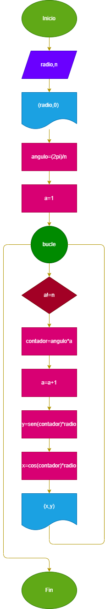

# coordenadas_circuferencia_radioX_2.0
Nueva versión.(En esta versión se redujo el número de bucles, pasando de 4 a solo 1)
Programa que permite obtener las coordenadas de una circunferencia de radio n, usando las razones trigonometricas seno y coseno. Ingresando el número de divisiones que se le hara a toda la circuferencia (Entre mas grande sea el número de divisiones mayor sera la presición y el número de coordenadas)
## Diseño
### diagrama de flujo 

